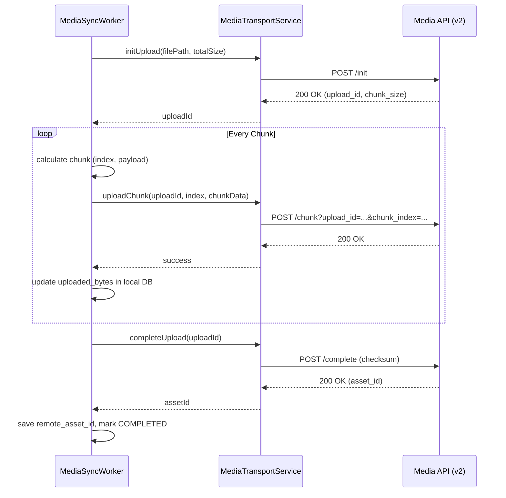

# Chunk Upload Protocol

## 1. Sequence Diagram

## 2. Chunking Boundaries
- **Chunk Size:** Strictly enforced at exactly `5MB` (5,242,880 bytes).
- **Final Chunk:** May be less than or equal to 5MB.
- **Client Restriction:** The client must NEVER read the full file into RAM. It must use `RandomAccessFile` or stream structures.

## 3. Retry Rules
- **Network Timeouts (HTTP 408, 503, 504, network reset):** Worker receives `RETRY_PENDING`. It will wait for the next background queue execution and re-attempt the EXACT same chunk index.
- **Client Crash:** Worker restarts, reads `uploaded_bytes`, determines `chunk_index`, and resumes precisely without repeating fully committed chunks.
- **Invalid Checksum (HTTP 400 on complete):** Entire file corrupted. Worker transitions to `FAILED`. File must be reset or re-evaluated.
- **Auth Failures (HTTP 401/403):** Worker transitions to `FAILED`. Upload cannot proceed until tokens are refreshed globally.

## 4. Concurrency limits
Mobile workers should process a maximum of one media asset simultaneously to prevent memory exhaustion on low-tier devices. Multiple chunk threads are NOT recommended.
