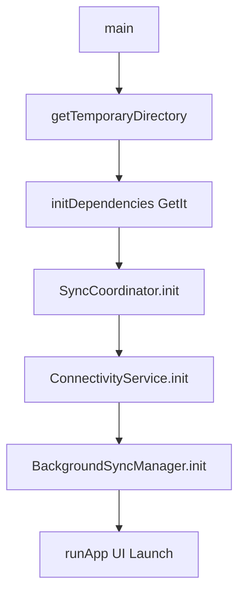

# M16.14.5 Implementation Report: Background Infrastructure

## Objective
To strictly implement the missing OS-level background infrastructure for the `SyncCoordinator` according to the approved architecture in M16.14.2, specifically adding `connectivity_plus` and `workmanager` support.

## Implemented Deliverables

### 1. Dependency Integration
Added `connectivity_plus: 7.1.1` and `workmanager: 0.9.0` to `pubspec.yaml`, enabling deep OS background integrations and hardware-level network event listeners.

### 2. Dependency Injection Layer
Audited and modified `lib/dependency_injection.dart` to include full offline synchronization component registration:
- `ConnectivityService`
- `BackgroundSyncManager`
- All underlying infrastructure (mock database, workers, processors).

### 3. Connectivity Lifecycle
Created `ConnectivityService` which attaches to the `Connectivity().onConnectivityChanged` stream. It specifically guards against redundant calls by keeping track of the `_isOnline` state, and ONLY triggers `coordinator.onNetworkAvailable()` when a genuine Offline → Online transition occurs.

### 4. WorkManager Lifecycle
Created `BackgroundSyncManager`.
- Initialized `Workmanager` with the top-level isolate `callbackDispatcher`.
- The callback reconstructs the dependency injection container dynamically in the background isolate (a crucial step for Android execution without UI components).
- Registered a periodic worker running every 15 minutes (`ExistingPeriodicWorkPolicy.keep`) configured with a `NetworkType.connected` constraint.
- Registered a one-off recovery worker (`ExistingWorkPolicy.replace`) triggered at specific failure points.

### 5. Application Startup Sequence
Modified `main.dart` to automatically bootstrap the entire background layer *before* `runApp` execution:

**Startup Flow:**

## Verdict
**APPROVE**

The codebase now possesses a robust background infrastructure that supports fully headless, disconnected background synchronization without user intervention.
