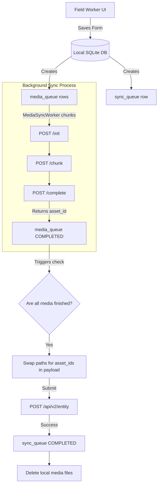

# Offline Architecture Overview

## 1. Vision
The Rural Risk Management application is shifting from a standard "online-first" model to a strict "offline-first" model. Because rural field workers often encounter zero connectivity for hours or days, the application must completely decouple data capture from data transmission.

## 2. Core Pillars
1. **Local-First Writes:** Every action (creating cattle, saving KYC, capturing signatures) MUST hit the local SQLite database first. UI responds instantly with a success message, irrespective of network status.
2. **Decoupled Binary Transport:** Large files (images, videos) cannot be uploaded synchronously with JSON metadata. They are handled by a dedicated background `MediaSyncWorker` that chunks binaries to prevent memory overflow and allows resuming uploads after crashes or network drops.
3. **Queue Dependency Management:** JSON payloads (`sync_queue`) cannot be submitted to the backend until all attached media files (`media_queue`) are completely uploaded and verified by the backend.
4. **Asset Reference Swapping:** Once binaries are uploaded, the backend returns lightweight `asset_id` strings. The local JSON payloads dynamically swap local file paths with these `asset_id` strings before final transmission.

## 3. Workflow Diagram

## 4. Final Verdict

**BACKEND IMPLEMENTATION READY**

The documentation package accurately defines the endpoints, idempotency guidelines, database schemas, and migration path. The backend team now has the exact blueprint required to construct the V2 media APIs safely and completely.
