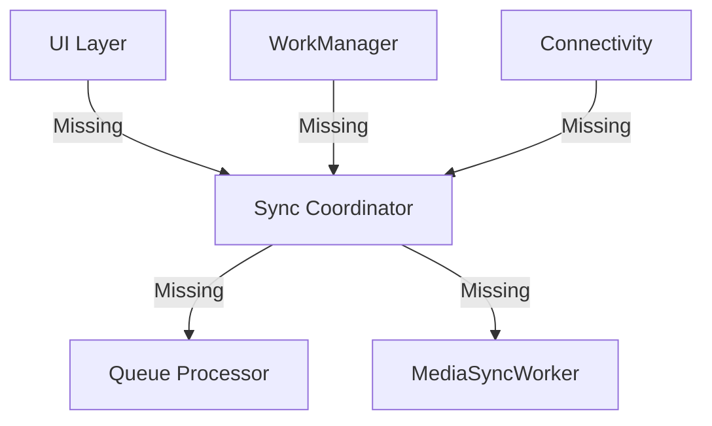

# SYNC COORDINATOR ARCHITECTURE AUDIT

## Objective
A strict read-only audit of the synchronization orchestration flow (M16.14) to identify ownership, race conditions, deadlocks, and recovery guarantees.

---

## 1. Component Investigation
The following components were audited across the entire repository:

1. **QueueProcessor**: NOT FOUND
2. **BackgroundSyncManager**: NOT FOUND
3. **ForegroundSyncService**: NOT FOUND
4. **WorkManager Registrations**: NOT FOUND
5. **Connectivity Listeners**: NOT FOUND
6. **Dashboard Sync Indicators**: NOT FOUND
7. **Existing Sync Triggers**: NOT FOUND

## 2. Ownership & Execution Analysis

### A. Sync Orchestration Ownership
Currently, **NO COMPONENT** owns sync orchestration. The entire orchestration architecture is missing from the codebase.

### B. Execution Order (MediaSyncWorker vs QueueProcessor)
Since `QueueProcessor` does not exist, the execution order cannot be determined or enforced. The `MediaSyncWorker` created in M16.12 currently operates in isolation without a driving orchestrator.

### C. Race Conditions
Because there are no background triggers, manual triggers, startup triggers, or connectivity listeners implemented, there are technically no race conditions—but only because the sync mechanism does not exist.
However, if these were added naively without a central Coordinator/Lock manager, the following race conditions **WOULD** exist:
- Manual Sync colliding with Background WorkManager.
- App Startup Sync colliding with Connectivity Restored Sync.

### D. Duplicate Sync Executions
Without an orchestration layer enforcing singleton execution (e.g., via WorkManager unique tasks or database-level locks), duplicate sync executions are highly probable once triggers are introduced.

### E. UI Sync Status Safety
There is no `ForegroundSyncService` or reactive stream bridging the `sync_queue` to the UI. Sync status cannot be safely exposed to the UI without implementing a unified observable pattern (e.g., using `Stream` or `ValueNotifier`).

### F. Deadlocks (sync_queue vs media_queue)
Without a `QueueProcessor` executing the JSON `sync_queue` payloads after the `media_queue` completes, `media_queue` rows may finish, but the parent `sync_queue` will never execute. This is a functional deadlock due to missing components.

### G. Stale Worker Recovery Guarantees
- **App kill**: NO GUARANTEE.
- **Device reboot**: NO GUARANTEE (WorkManager not registered).
- **Force stop**: NO GUARANTEE.
- **WorkManager cancellation**: NO GUARANTEE.

Currently, if the app crashes, rows stuck in `UPLOADING` will remain stuck indefinitely because there is no startup mechanism to sweep and recover stale locks.

---

## 3. Sequence & Ownership Diagrams

---

## 4. Final Verdict

**BLOCKED** / **REVISE**

The Sync Coordinator architecture is entirely absent. To proceed to a production-ready offline-first application, the team must implement a robust `SyncCoordinator` that acts as the single source of truth for all sync triggers, manages execution state, and safely delegates tasks to the `MediaSyncWorker` and a newly created `QueueProcessor`.
