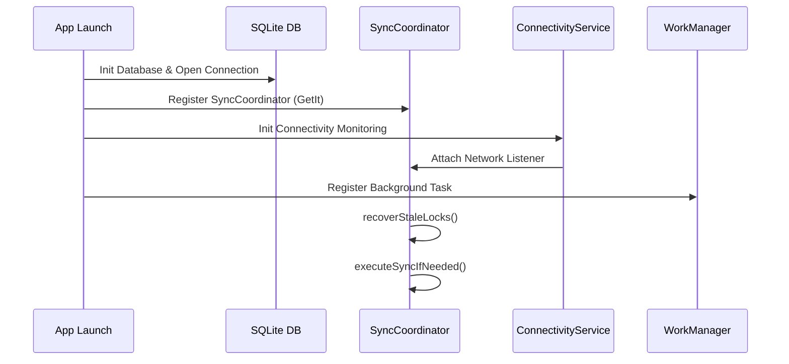
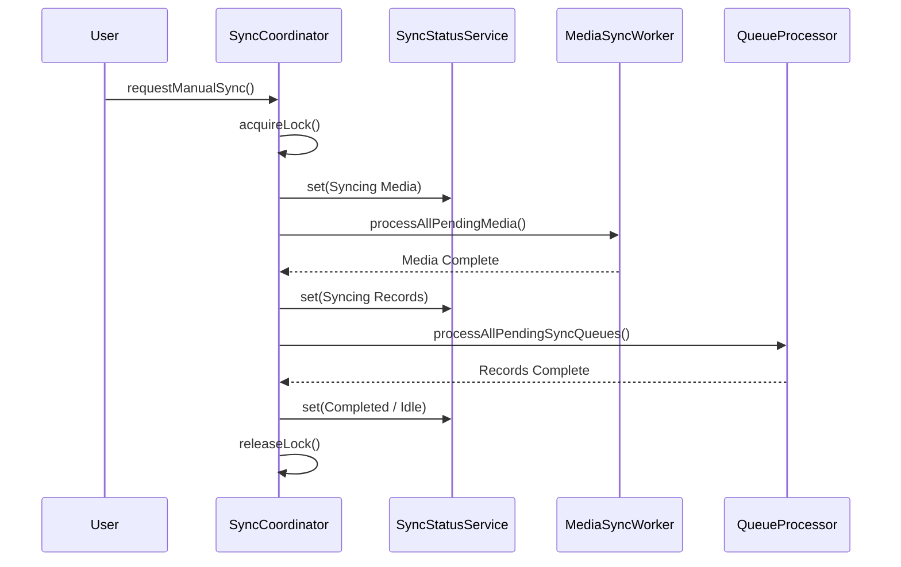
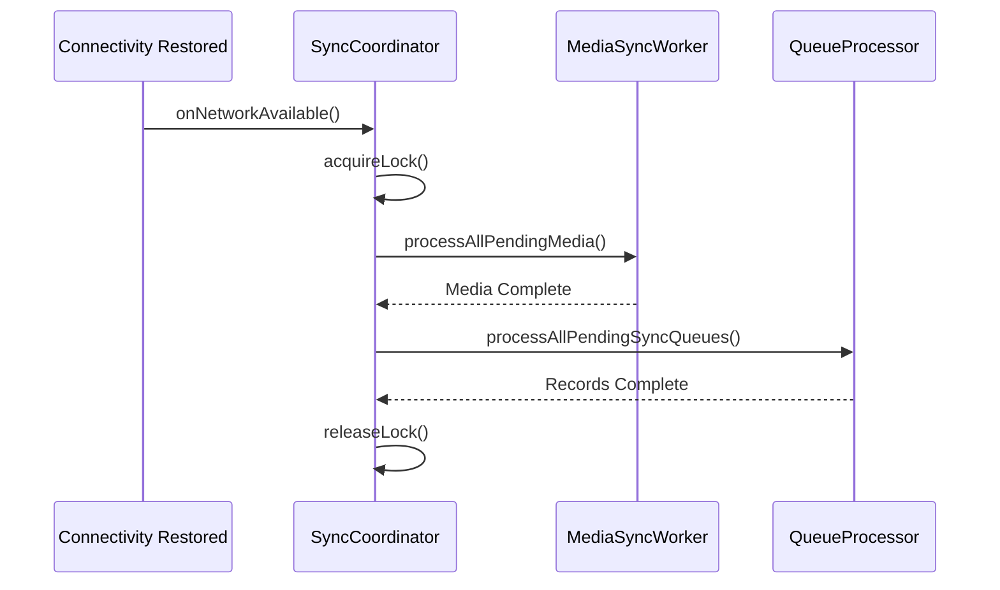
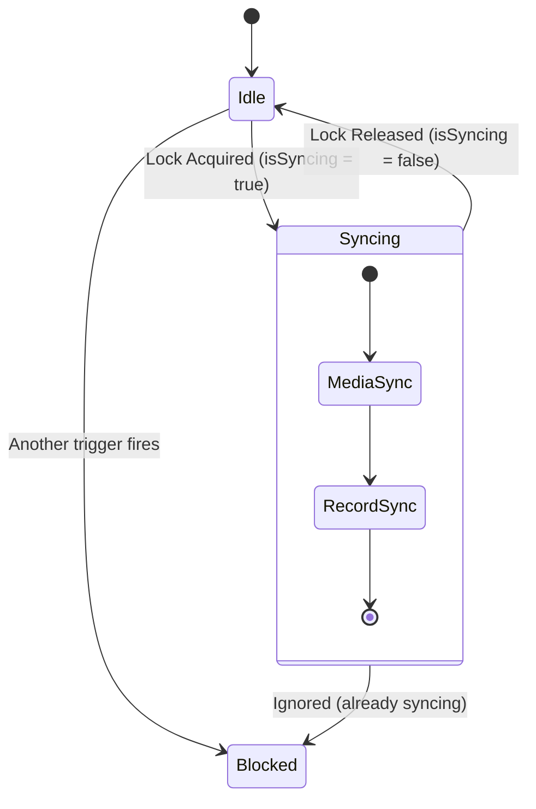

# SYNC COORDINATOR ARCHITECTURE DESIGN

## 1. Ownership & Service Model

### Service Interfaces
The architecture requires three core services:
1. **SyncCoordinator**: The single source of truth for all data transmission. It explicitly owns `MediaSyncWorker` and `QueueProcessor`. External modules MUST NOT directly invoke workers.
2. **ConnectivityService**: Monitors network availability using OS-level listeners and notifies the Coordinator.
3. **SyncStatusService**: Provides a reactive stream (`Stream` or `Rx` variables via GetX) bridging the background sync state to the UI without direct coupling.

### Service Ownership Hierarchy
```text
[App Lifecycle] & [UI Actions]
      │
      ▼
SyncCoordinator <── ConnectivityService
      │
      ├─► MediaSyncWorker (Chunks binary files)
      │
      ├─► QueueProcessor (Transmits JSON payloads)
      │
      └─► SyncStatusService (Broadcasts state to UI)
```

---

## 2. Startup Flow (Initialization Order)
On app launch, initialization must happen sequentially to prevent race conditions during early bootstrap.



---

## 3. Execution Flows

### A. Manual Sync Flow
When the user taps "Sync Now" on the Dashboard:


### B. Background Sync Flow
When connectivity is restored while the app is running or paused:


---

## 4. Locking Model (Deadlock & Collision Prevention)
To prevent duplicate execution and collisions (e.g., Manual Sync firing while Background Sync is running), the `SyncCoordinator` uses a Mutex (Memory Lock) and Database Locks.

**Locking Diagram:**


**Locking Rules**:
1. **Memory Lock**: `bool _isSyncing` prevents multiple concurrent executions within the same app session.
2. **DB Lock**: Rows transition from `PENDING` to `UPLOADING` to prevent a duplicate process (e.g., WorkManager waking up) from grabbing the same data.
3. **Queue Prioritization**: Triggers are ignored if `_isSyncing == true`. The system relies on the next event or periodic background check.

---

## 5. UI Status Stream
The `SyncStatusService` exposes an Enum stream to the UI:
- `IDLE`: No sync active.
- `SYNCING_MEDIA`: Uploading large files.
- `SYNCING_RECORDS`: Uploading JSON payloads.
- `COMPLETED`: Temporary success state (returns to IDLE).
- `FAILED`: Temporary failure state (returns to IDLE).

---

## 6. Failure Recovery Flow
If the app is killed or forced stopped during a sync, the database rows may be stuck in `UPLOADING`.

**Stale Worker Recovery**:
During `SyncCoordinator.init()` and WorkManager task start:
1. `SyncCoordinator` runs `recoverStaleLocks()`.
2. Updates `media_queue` AND `sync_queue` where `status == 'UPLOADING'` back to `PENDING`.
3. Ensures all interrupted jobs are cleanly resumed exactly where they left off (e.g., MediaSyncWorker resumes using `uploaded_bytes`).

---

## Final Verdict

**READY FOR IMPLEMENTATION**

The SyncCoordinator design covers all race condition edge cases, firmly establishes component ownership, provides clear sequence and state paths, and guarantees stale lock recovery across hard app kills. The development team can immediately implement this blueprint.
