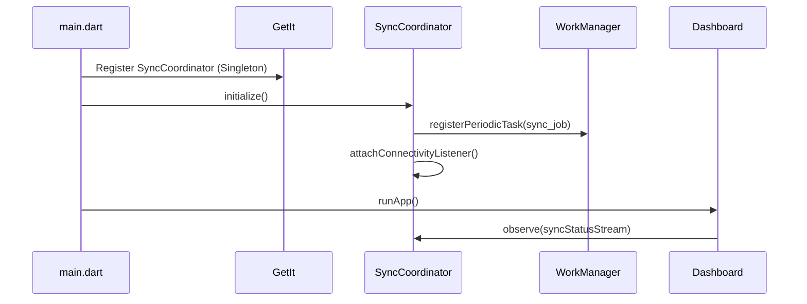

# SYNC INFRASTRUCTURE FOUNDATION AUDIT

## Objective
To strictly audit the existing mobile infrastructure capabilities necessary to support a robust, background-capable synchronization orchestration layer.

---

## 1. Component Inventory

### A. Existing Component Inventory
The following infrastructure already exists in the repository:
- **Service Locator / Dependency Injection**: `Get` (GetX 4.6.6) and `getIt` (8.0.3) are actively used for state management and singleton injection.
- **Startup Initialization Flow**: `main.dart` possesses an asynchronous startup block (`WidgetsFlutterBinding.ensureInitialized()`, `GetStorage.init()`) where initialization hooks can be safely added before the first frame renders.

### B. Reusable Component Inventory
- **GetX Reactive State**: Can be repurposed to stream the local `sync_queue` and `media_queue` progress counts safely into the UI (Dashboard).
- **GetIt Singletons**: Can house the newly required `SyncCoordinator` to ensure a singleton lifecycle independent of UI widgets.
- **App Lifecycle Observers**: Flutter's native `WidgetsBindingObserver` can be implemented without external plugins to detect when the app resumes or pauses.

### C. Missing Component Inventory
The following critical components MUST be built or installed:
- **Connectivity Monitoring**: No plugin (e.g., `connectivity_plus` or `internet_connection_checker`) is installed to listen for network restorations.
- **Background Execution Support**: No background workers (e.g., `workmanager`, `background_fetch`, `flutter_foreground_task`) are present to execute the `MediaSyncWorker` while the app is closed.
- **Dashboard Widgets**: The current `home_page.dart` lacks upload counters, pending queue counts, or any visual sync indicators.
- **Notification Infrastructure**: No package (e.g., `flutter_local_notifications`) exists to inform the user of background sync failures or successes.

---

## 2. Recommended Implementation Strategy

### Recommended Ownership Model
The following execution chain is recommended to guarantee strict ownership and eliminate race conditions:
```
App Startup (main.dart) -> registers -> WorkManager
ConnectivityListener -> triggers -> SyncCoordinator
SyncCoordinator -> exclusively owns -> MediaSyncWorker (Chunks)
SyncCoordinator -> exclusively owns -> QueueProcessor (JSON)
SyncCoordinator -> broadcasts -> UI Status Updates (GetX)
```

### Startup Sequence Diagram


### Recommended Implementation Order
1. **Dependency Installation**: Add `workmanager`, `connectivity_plus`, and `flutter_local_notifications` to `pubspec.yaml`.
2. **Dashboard UI Indicators**: Implement reactive GetX widgets in `home_page.dart` to display pending items.
3. **SyncCoordinator Singleton**: Build the central orchestrator and inject it via `GetIt`.
4. **Lifecycle Hooks**: Attach network listeners and `WidgetsBindingObserver` to the `SyncCoordinator`.
5. **Background Registration**: Register the `SyncCoordinator` execution loop within the `workmanager` dispatcher callback.

---

## Final Verdict

**PARTIAL FOUNDATION**

While the project has an established dependency injection and reactive state manager (`GetX` / `GetIt`) capable of supporting the architecture, absolutely none of the necessary background processing, network listening, or UI indication plugins exist yet. These must be implemented before orchestration can function.
